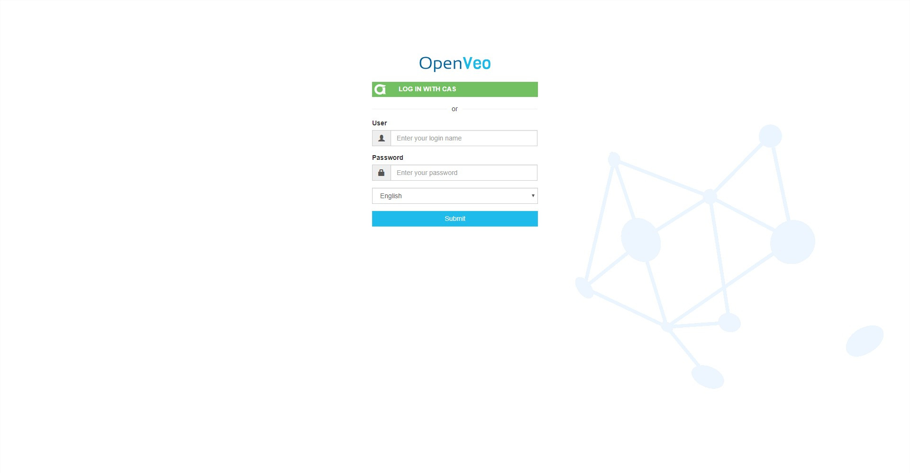
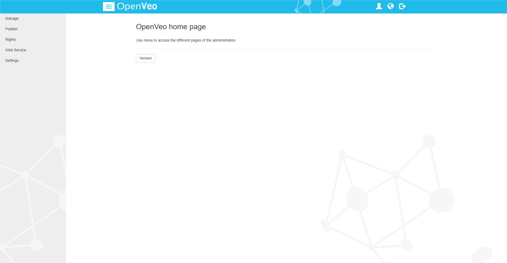

# What's OpenVeo ?

OpenVeo is a [Node.js](http://nodejs.org/) and [AngularJS](https://angularjs.org/) CMS. It embeds an HTTP server based on Express framework ([Express](https://www.npmjs.com/package/express)), a Socket server based on [socket.io](http://socket.io/) framework and a plugin loader mechanism.

The core of the system (i.e. without any plugin) offers a simple connection form to the administration interface.

This interface gives access to a limited set of default features:

-  Users management
-  Permissions, roles and groups management
-  Web service management
-  A profile page

Each plugin brings zero to many additive administration pages and zero to many additive public pages.

## Compatibility

OpenVeo is tested on the following operating systems :

- Windows 10
- Ubuntu 16.04
- Xubuntu 16.04

OpenVeo is tested on the following browsers :

- Google Chrome 54
- Mozilla Firefox 47
- Opera 42
- Internet Explorer Edge

## Screenshots

### Login page

### Back end home page

### Back end roles management page

### Back end users management page

### Back end groups management page

### Back end applications management page
